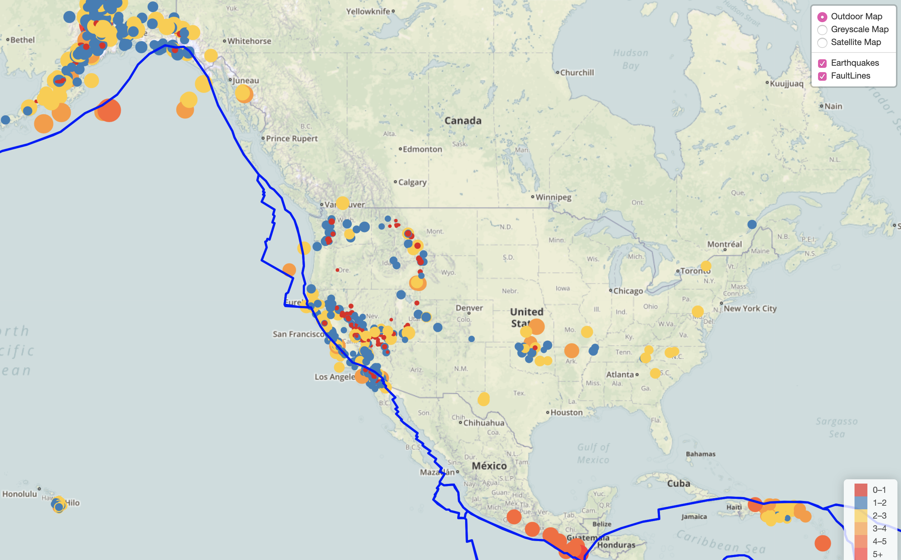

# Leaflet Challenge - Visualizing Data with Leaflet

## Background

This map represents a visualization of earthquake and tectonic plate data in the world over the past 7 days. 

### Link: https://beatriz3692.github.io/leaflet-challenge/

